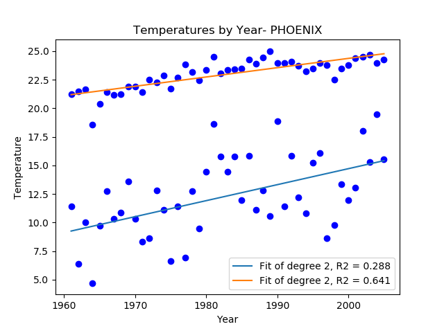

# ClimateChange
A regression model based on historical temperature data for 20 US Cities

### Running the program:
Run the program how you would any other python program. Feel free to change the city near the top of the program (current default is Phoenix)

### Output
The program outputs a regression model with two different plots

### Result
The outputs point towards a general increase in temperature across all major US cities over the past half century
